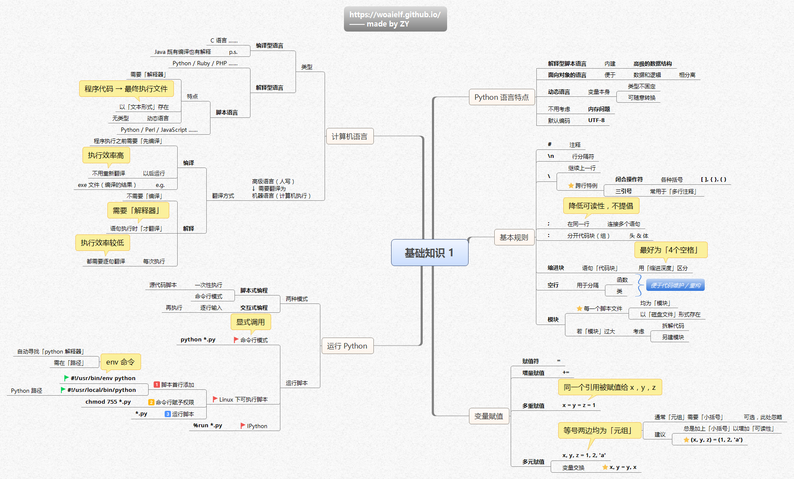
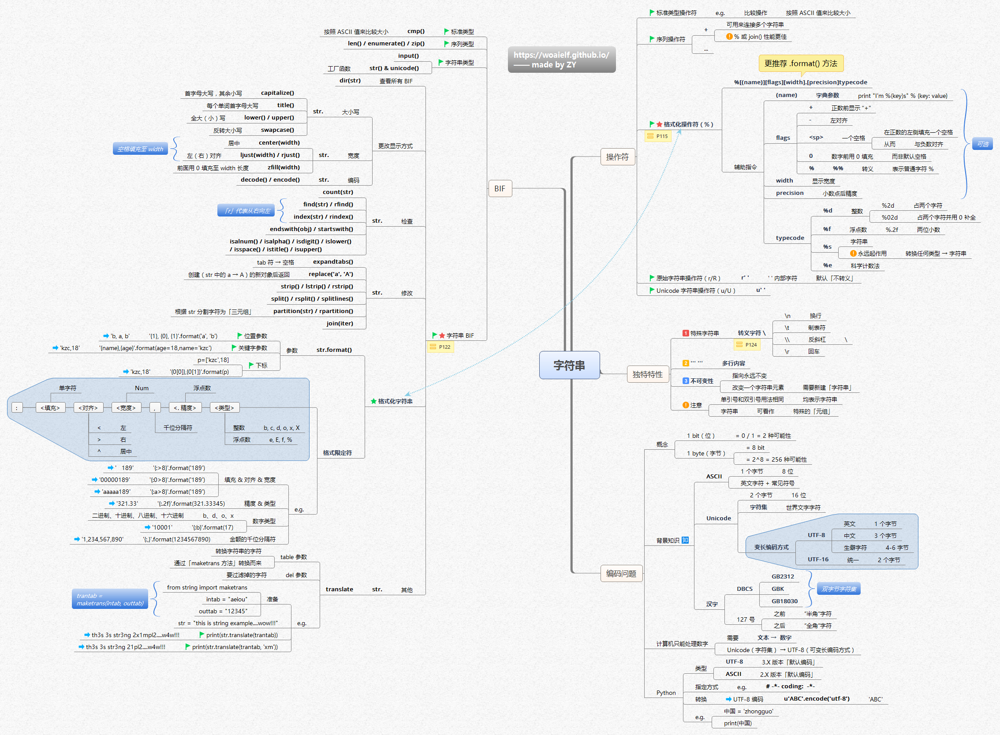
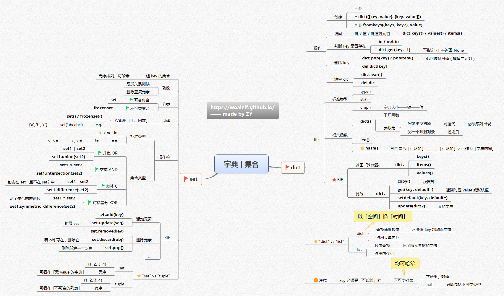
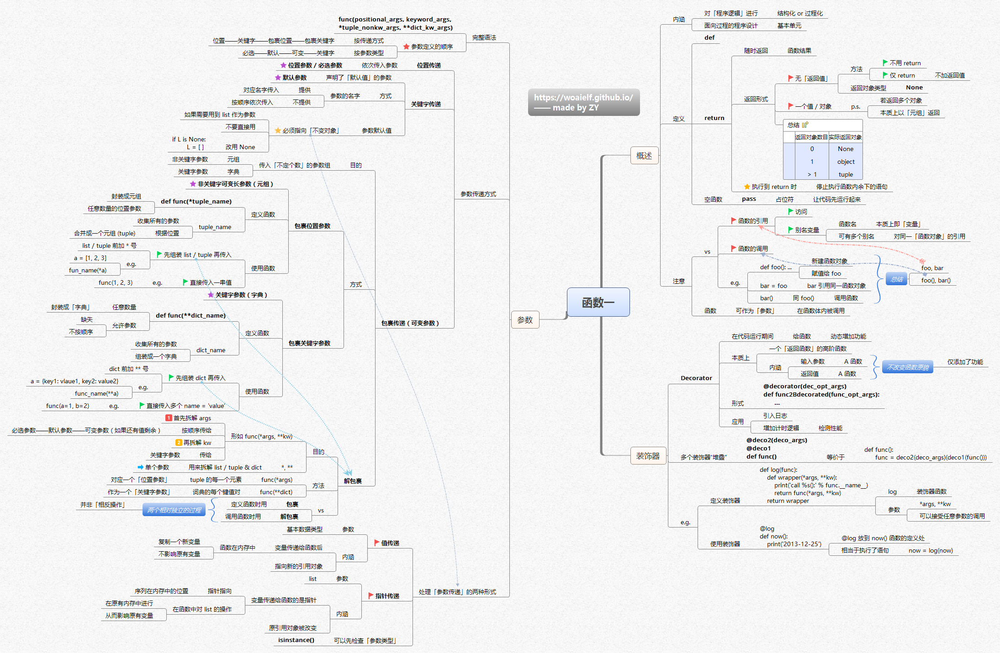
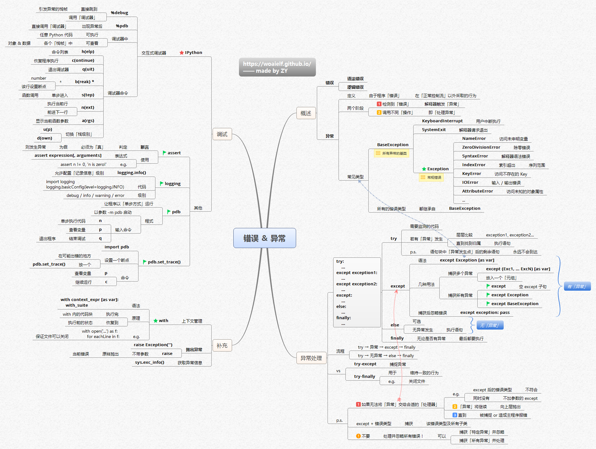

# pytutorial
Tutorial for python learning

These materials are referenced from [https://woaielf.github.io](https://woaielf.github.io).

## Overview of article structure

## Basic knowledge 1

## Basic knowledge 2

## Type of data

## Sequence

## String

## List Element

## Dictionary Set

## Function 1

## Function 2

## Condition Loop

## File Object

## Module

## Error exception

## Object-Oriented Programming

