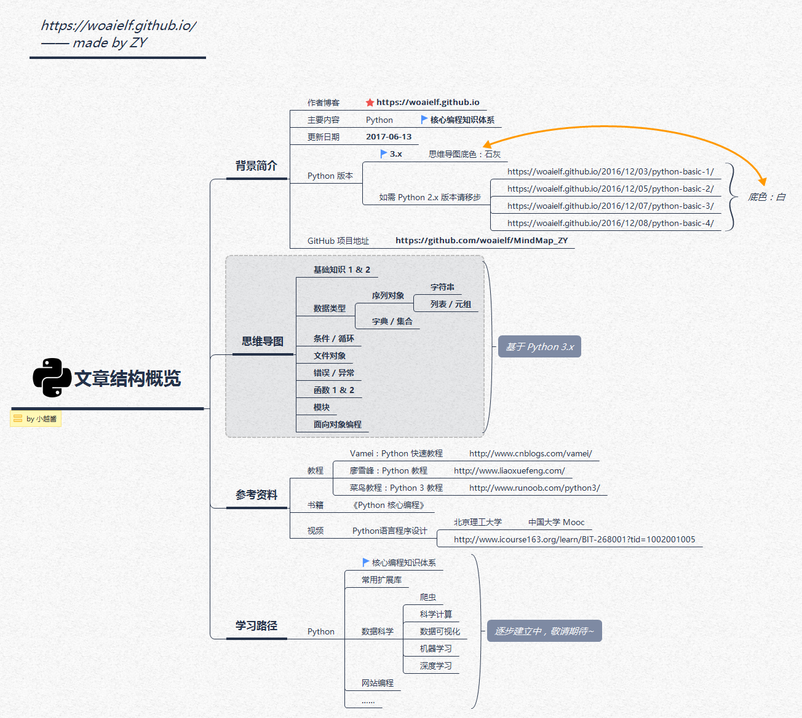

# pytutorial
Tutorial for python learning

These materials are referenced from [https://woaielf.github.io](https://woaielf.github.io).

## Overview of article structure

## Basic knowledge 1

## Basic knowledge 2

## Type of data

